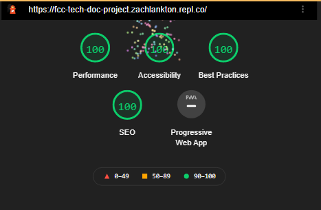

# Quick Custom Elements

## Introduction

Quick Custom Elements (QCE) is as simple as its name. It allows you to quickly and easily create custom HTML elements and components using browser supported built in <template> tags. No need to create a custom element class or write constructors or mess with attaching the shadowDOM. QCE does this for you.

Quick Custom Elements was designed to be as small and light weight as possible while exposing the full power and features of Web Components Standards. This project was developed with these key features in mind:

- Small (less than 100 Lines of Code)
- Fast (smallest hit to page speed possible)
- Easy to use and easy to learn
- Thinnest Layer of Abstraction Possible
- Style and Script Encapsulation
  
  
  
### [Try in Repl.it](https://replit.com/@ZachLankton/Quick-Custom-Element-Demo-One)

``` html
  Basic Usage: 

  <head>

      <template id="custom-elm">
          <h1> <slot> </slot> </h1>
      </template>

      <script src="quick-custom-elements.js"></script>

  </head>

  <body>
      <!-- This will render an <h1> Hello World </h1> on the page -->
      <custom-elm> Hello World </custom-elm>
  </body>
```
  
  .
  
  
## Jump to a Section
  
- [Introduction](#introduction)
- [Installation](#installation)
- [Basic Template](#basic-template)
- [Template 'src' Attribute](#template-src-attribute)
- [Template Scripts](#template-scripts)
- [Attribute Changed](#attribute-changed)
- [Event 'qce-loaded'](#event-qce-loaded)
- [More Complete Example](#more-complete-example)
- [Performance](#performance)

.
  

## Installation
  
Installation is very simple, just need to include the script at the bottom of your head tag or your body tag. Including in the head tag will help to reduce any flash of unstyled content and will help ensure your components are ready before the page renders, but will block rendering of the page. 
  
To improve user experience you can write your page to show basic content and styles right away and then defer loading of non critical components to be rendered later. In this case including at the bottom of your body tag (and even adding the 'defer' attribute) will help page speed.

You can obtain the script source from this github repo.
  
``` html
  <body>
      ... other tags

      ... more tags

      <script src="quick-custom-elements.min.js"></script>

  </body>
  
```
  
.
  

## Basic Template
  
QCE uses template tag 'id' attribute as the name of the custom element. (Remember that custom elements need a '-' in them to be legal.) Slot Elements (including named slots) can be used just as you would expect. For more info read here: [Web Components | MDN](https://developer.mozilla.org/en-US/docs/Web/Web_Components)

QCE automatically attaches templates to the shadow DOM which gives us the power of scoped styles by default. See the code below and try it out in Repl.it to see it in action
  
### [Try in Repl.it](https://replit.com/@ZachLankton/QSE-basic-template#index.html)
  
``` html
  <template id="my-card">
      <style> 
          /* These styles are scoped only to the html inside this template */
          #card {
              border-radius: 5px;
              border: 1px solid black;
              padding: 5px;
              margin: 5px;
              max-width: 250px;
          }
      </style>

      <div id="card">
          <h1> <slot name="title"></slot> </h1>
          <p> <slot name="content"></slot> </p>
      </div>
  </template>
  
```
  
.
  
  
## Template 'src' Attribute
  
As you can imagine, cluttering up your head tag with 1000's of lines of template tags will become unbearable. Luckily, QCE looks for template tags with the 'src' attribute and fetchs templates from separate files. This allows you to organize your code the way you want. 
  
Keep in mind that templates loaded this way are loaded asynchronously. This means the component may not be ready before the page starts to render. To help with this QCE provides a 'qce-loaded' event that fires on the document once all templates are loaded.

Using the 'my-card' element from the previous example above we can separate the template into a file called 'my-card.html' and just point the template src attribute to it. And just like we don't wrap our js files with script tags, we do not need to wrap our template files with template tags.
  
``` html
  
  =======================
  head tag of index.html
  =======================

  <head>

      ... other head tags

      <template id="my-card" src="my-card.html"></template>
      <script src="quick-custom-elements.js"></script>

  </head>


  ===================
  file: my-card.html
  ===================

  <style> 
    /* These styles are scoped only to the html inside this template */
    #card {
      border-radius: 5px;
      border: 1px solid black;
      padding: 5px;
      margin: 5px;
      max-width: 250px;
    }

  </style>

  <div id="card">
      <h1> <slot name="title"></slot> </h1>
      <p> <slot name="content"></slot> </p>
  </div>
  
```
  
.
  
  
## Template Scripts
  
In addition to styles, scripts can also be scoped to the template. Regular script tags in your template are in fact global as you might expect (and not recommended), but add a supported attribute to your script tag and QCE provides a scoped script for you. Complete with a working reference to "this", which is a reference to the specific instance of one of your custom elements attached to the DOM.

QCE supports multiple script tags in a single template. You can hook into any of the [Custom Element Life Cycle Callbacks](https://developer.mozilla.org/en-US/docs/Web/Web_Components/Using_custom_elements#using_the_lifecycle_callbacks) with a simple attribute on your script tag. QCE supports the following life cycle callbacks:

- <script constructor>
- <script connected>
- <script disconnected>
- <script adopted>
- <script attribute-changed="[ 'id', 'custom-attribute' ]">
  
### [Try in Repl.it](https://replit.com/@ZachLankton/QCE-Template-Scripts)
  
``` html
  ==================
  File: my-card.html
  ==================

  <div id="card">
      <h1> <slot name="title"></slot> </h1>
      <p> <slot name="content"></slot> </p>
  </div>

  <script connected>

    // get the h1 element for the title slot (template html above)
    const h1 = this.shadowRoot.querySelector("h1")

    // get the span element for the title slot (body html below)
    const title = this.querySelector("[slot='title']")

    // setup click handler -> alerts "Test Title"
    h1.addEventListener( "click", e => alert(title.innerHTML) )

  </script>


  =====================
  In body of index.html
  =====================
  <my-card>
    <span slot="title">Test Title</span>
    <span slot="content">Test Content</span>
  </my-card>
  
```
  
.

  
## Attribute Changed
  
The Attribute Changed life cycle callback can be helpful for giving your component dynamic attributes that control the functionality and appearance of your element. This lets you watch for changes on these attributes and respond to them.
  
[Try in Repl.it](https://replit.com/@ZachLankton/QCE-Attribute-Changed)
  
``` html
  <div id="card">
      <h1> <slot name="title"></slot> </h1>
      <p> <slot name="content"></slot> </p>
  </div>

  <script attribute-changed="['color', 'bg']">
    // the value of attribute-changed must be
    // a string representation of an array
    // this event only fires when an attribute 
    // listed in the array changes

    // arguments exposed in this scope
    // 'attributeName' is the name of the attribute
    // 'oldValue' is the old value of the attribute
    // 'newValue' is the new value of the attribute

    const h1 = this.shadowRoot.querySelector("h1")

    if (attributeName == "color") h1.style.color = newValue

    if (attributeName == "bg") h1.style.backgroundColor = newValue

  </script>
  
```
  
.
  
  
## Event qce-loaded
  
QCE fires an event on the document once it has loaded all of the templates. This can be helpful for displaying a 'Loading' message to the user and then removing it when all the custom elements are loaded and ready.

The name of this event is 'qce-loaded'. Below is an example of usage:
  
``` html
  <script>
        document.addEventListener("qce-loaded", e => {
            document.getElementById("loading").style.display = "none"
        })
  </script>
  
```
  
.
  
  
## More Complete Example
  
For a more complete example of using Quick Custom Elements take a look at the [source code](https://replit.com/@ZachLankton/FCC-Tech-Doc-Project) for the [documentation page](https://FCC-Tech-Doc-Project.zachlankton.repl.co). Most of the custom elements in the docs page do not utilize the shadowDOM and scoped styles because the docs page was created as a Free Code Camp Responsive Web Design Project and the Free Code Camp Test Suite does not reach down into the shadowDOM to see if the elements, ids, and styles exist.

Because of this, QCE was used more for templating out the sections and layouts of the docs page.

The 'my-section' component shows an example of a component that has a 'src' attribute that can get its content from a dynamically loaded json file. Every Section on the docs page is loaded from its own json file. A snapshot of that component is shown below.

The 'my-navbar' component listens for the 'my-section-started' event to dynamically build navigation from the content in the sections. This means that navigation does not need to be manually updated everytime a section is changed, added, or removed. Pretty Cool, Huh?!
  

``` html
  
  <section class="main-section" id="my_section">
    <header>Loading Section...</header>
    <p></p>
    <p></p>
    <ul>
    </ul>
    <code class="language-html">
    <a href="#"><button>Try in Repl.it</button></a>
  </section>

  <script constructor>

    const src = thisElm.getAttribute("src");

    async function buildSection() {

      const res = await (await fetch(src)).json();

      const section = sRoot.querySelector("section");
      const header = sRoot.querySelector("header")
      const ul = sRoot.querySelector("ul")
      const p1 = sRoot.querySelectorAll("p")[0]
      const p2 = sRoot.querySelectorAll("p")[1]
      const code = sRoot.querySelector("code")
      const btn = sRoot.querySelector("a");
      const id = res.name.replaceAll(" ", "_");

      section.id = id;
      res.id = id;
      header.innerHTML = res.name;
      res.list.forEach( (l)=>{ appendLI(ul, l) });
      p1.innerHTML = res.p1;
      p2.innerHTML = res.p2;
      code.innerHTML = escapeHTML(res.code);
      Prism.highlightElement(code);
      if (res.repl) {
        btn.style.display = "";
        btn.href = res.repl;
      }

      // not using scoped styles
      // attaching the template directly to the DOM 
      // so that global CSS styles will apply
      thisElm.after(sRoot);
      thisElm.remove();

      return res
    }

    // passing the promise in the custom event
    // for other components to use (like the navbar)
    const section = buildSection()
    emitSectionStarted( section );

    function emitSectionStarted(data){
      const event = new CustomEvent('my-section-started', {
        bubbles: true,
        detail: data
      });
      document.dispatchEvent(event);
    }


    // HELPER FUNCTIONS
    function appendLI(ul, txt){
      const li = document.createElement("li")
      li.innerHTML = txt;
      ul.appendChild(li);
    }

    const escape = document.createElement('textarea');
    function escapeHTML(html) {
        escape.textContent = html;
        return escape.innerHTML;
    }

    function unescapeHTML(html) {
        escape.innerHTML = html;
        return escape.textContent;
    }

  </script>
  
```
    
.
    
## Performance
QCE has excellent page performance characteristics. Check out the [official docs](https://FCC-Tech-Doc-Project.zachlankton.repl.co) page from more info.
    

